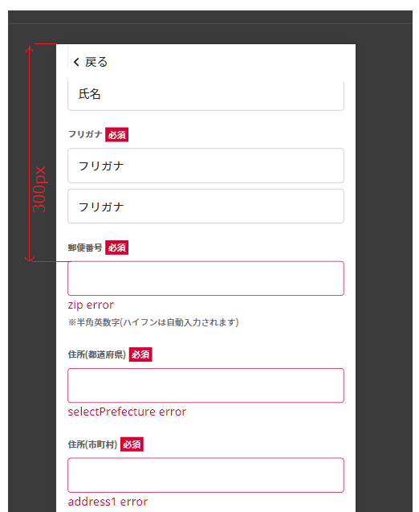

# List of commons

## 1. utils
File contain source code is `packages/myaccount/common/utils.ts`.
### setCookie
### getCookie
### ggjDebounce
### scrollToElSmoothly
The native method "Element.scrollIntoView" is not smooth in IOS. ([mozilla ref](https://developer.mozilla.org/en-US/docs/Web/API/Element/scrollIntoView)) This function use to "scrollToElSmoothly", support for IOS.
- How to use (Basic usage):
  ```
  import { scrollToElSmoothly } from 'common/utils'
  ...
    scrollToElSmoothly({
      el: element as HTMLElement,
    })
  ...
  ```
- Integrate with `react hook form`:
  ```
  import Typography from '@mui/material/Typography'
  import Button from '@mui/material/Button'
  import { useEffect } from 'react'
  import { css } from '@emotion/react'
  import { Controller, useForm } from 'react-hook-form'
  import { scrollToElSmoothly } from 'common/utils'
  import TextField from "@mui/material/TextField"
  type MemberFormData = {
    firstName: string
  }
  function Member() {
    const { handleSubmit, control, formState: { errors } } = useForm<MemberFormData>({
      reValidateMode: 'onSubmit',
      shouldFocusError: true,
    })
    const onSubmit = (async() => {
      const fn = await handleSubmit(
        (data) => {
          console.log(data)
          alert('OK')
        }
      )
      await fn()
    })
    useEffect(() => {
      if(errors)
      {
        const fields =  Object.keys(errors||{})
        if(fields.length)
        {
          const element = document.querySelector(`[name=${fields[0]}]`)
          scrollToElSmoothly({
            el: element as HTMLElement,
            focusEl: true,
            positionOffset: 300,
          })
        }
      }
    })
    return <div>
      <div css={css`margin: 60vh 0;`}>
        <Controller
          control={control}
          name="firstName"
          defaultValue=""
          rules={{
            required: true,
          }}
          render={({ field, formState: { errors },}) => (
            <TextField
              {...field}
              error={Boolean(errors.firstName)}
              inputRef={field.ref}
              variant="outlined"
              placeholder="firstName"
              fullWidth={true}
            />
          )}
        />
        {errors.firstName && <Typography color="error">firstName error</Typography>}
      </div>
      <Button onClick={onSubmit} variant="contained" css={css`margin-bottom: 80px;`}>Submit</Button>
    </div>
  }
  
  export default Member
  ```
- Options:

| Syntax           | Description                                                                | Default             |
|------------------|----------------------------------------------------------------------------|---------------------|
| `el`             | element scroll to                                                          | -                   |
| `duration`       | scroll duration (in millisecond)                                           | 300                 |
| `positionOffset` | control position of element after scroll (in px)                           | `screen.height*0.3` |
| `cb`             | callback function                                                          | -                   |
| `focusEl`        | if value is true, focus on the element (only working for HTMLInputElement) | true                |
- positionOffset description:

  With this option:
  ```
  ...
  scrollToElSmoothly({
    el: element as HTMLElement,
    positionOffset: 300, // px
  })
  ...
  ```

  Position after scroll:

  

  By default, the positionOffset is 30% height of device (`screen.height*0.3`).


## 2. date
File contain source code is `packages/myaccount/common/date.ts`.
## 3. number
File contain source code is `packages/myaccount/common/number.ts`.
## 4. http
File contain source code is `packages/myaccount/common/http.ts`.
## 5. i18n utils
File contain source code is `packages/myaccount/common/i18nUtils.ts`.
