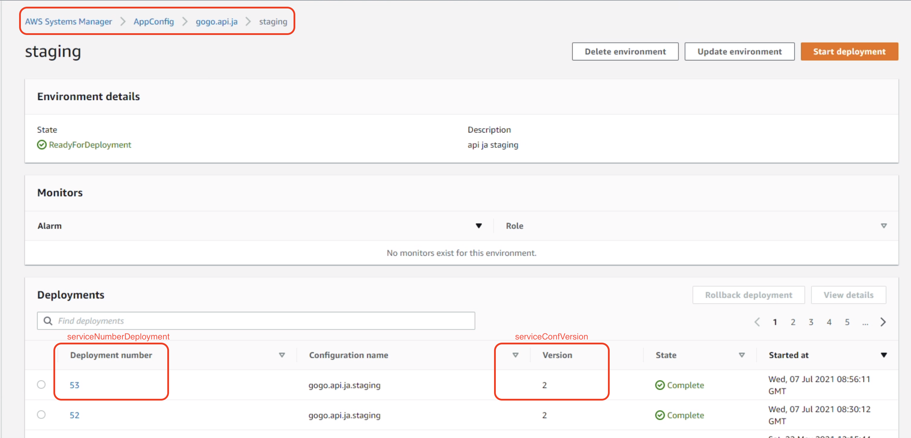

# library - configs
This package are used to read the configuration from the configs-server

[npm registry](http://registry.gogojungle.net/-/web/detail/@ggj/configs)

## Workflow
1. Call http request to
`GET /configs/v2/env?token=&service={...}&env={...}`
2. return {Object|Array}
Example:
```
http://{host_url}/configs/v2?token={...}&service=gogo.api.ja&env=staging
```

## Usage
1. Add the below fields to your environment variables
available [here](https://www.notion.so/ggjungle/config-v2-environment-variables-b082f4d162cd41dda1f3770d61750bfc)
```
ENV=production|staging|dev|dev_local
CONFIG_ENTRY=
CONFIG_TOKEN=
```

> For Windows
*Run Command Prompt as administrator*
```shell
setx -m CONFIG_ENTRY "your value"
setx -m CONFIG_TOKEN "your value"
setx -m ENV "your value"
```
⚠️ In windows, you must restart your CLI to make effect

> For Linux
 ```bash
echo "export CONFIG_ENTRY=\"your value\"" >> $HOME/.bashrc
echo "export CONFIG_TOKEN=\"your value\"" >> $HOME/.bashrc
echo "export ENV=\"your value\"" >> $HOME/.bashrc
 ```
⚠️ In Linux, you must restart your session to make effect

2. Add `"@ggj/configs" : "<version>"` to field `dependencies` in package.json

For lastest version, check [here](http://registry.gogojungle.net/-/web/detail/@ggj/configs)

> For Use AWS config, need to set ENV follow
[AWS set env doc](https://docs.aws.amazon.com/cli/latest/userguide/cli-configure-envvars.html#envvars-set)

Examples
---


```javascript
  process.env.IS_AWS_CONFIG = 1 // Flag to get config from AWS `AppConfig` OR `Parameter Store`
  const value = await configs.getConfigs()
  const DBconfigs = await configs.getDbConfigs(['common', 'surfaces', 'master', 'videos', 'salons'])
  const commonConfigs = await configs.getCommonConfigs(['FX_ON_URL', 'GOGOJUNGLE_URL', 'GOGO_DOMAIN'])
  console.log(value, DBconfigs, commonConfigs)
```

> For function `getConfigs` , AWS recommend set version to get, add `config_version` to `packages.json`

```
{
  ...,
  "engines": {
    "node": "10.16.0"
  },
  "config_version": "1",
  ...
}
```

:page_facing_up: For more detail, please check the [examples](https://github.com/gogojungle/configs.gogojungle.co.jp/blob/staging/packages/lib-configs/examples.md)

### Development
## 1. Deployment
- Update version in `package.json`
- run: `./publish.bat` (windows)

## Apply for service
### 1 Add library or update package to version 1.1.3
if new service
```aidl
yarn add @ggj/configs
```

```json
     "dependencies": {
        ...,
        "@ggj/configs": "1.1.3",
        ...
     }
```

### 2 Create file name ".awsConfVer.yaml"
You must correct the value as your service.
In case `serviceNumberDeployment.production` & `commonNumberDeployment.production`. We will correct when releasing
```
serviceConfVersion: 1
commonConfVersion: 1
serviceNumberDeployment:
  local: 1
  staging: 1
  production: 1
commonNumberDeployment:
  local: 1
  staging: 1
  production: 1
```
https://ap-northeast-1.console.aws.amazon.com/systems-manager/appconfig/applications/mtdemco/environments/n1i1quo?region=ap-northeast-1

### 3 Run service to get new configuration
### 3 Verify .env.yaml and .db.yaml
